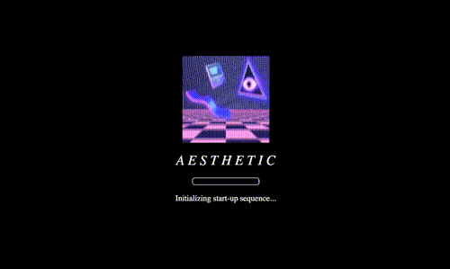
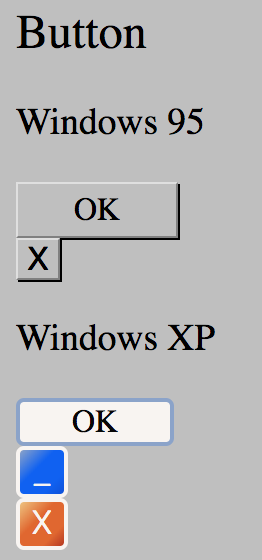
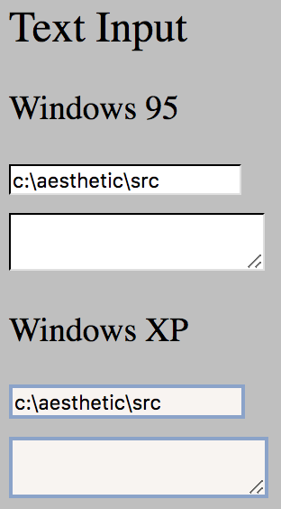
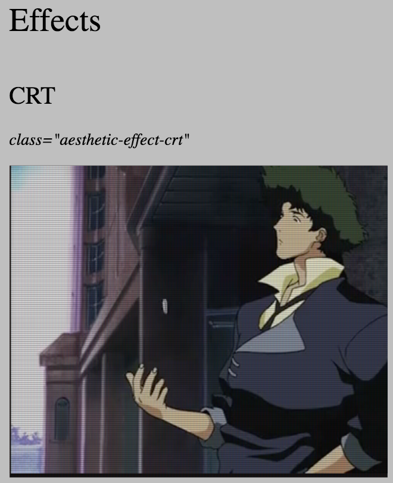
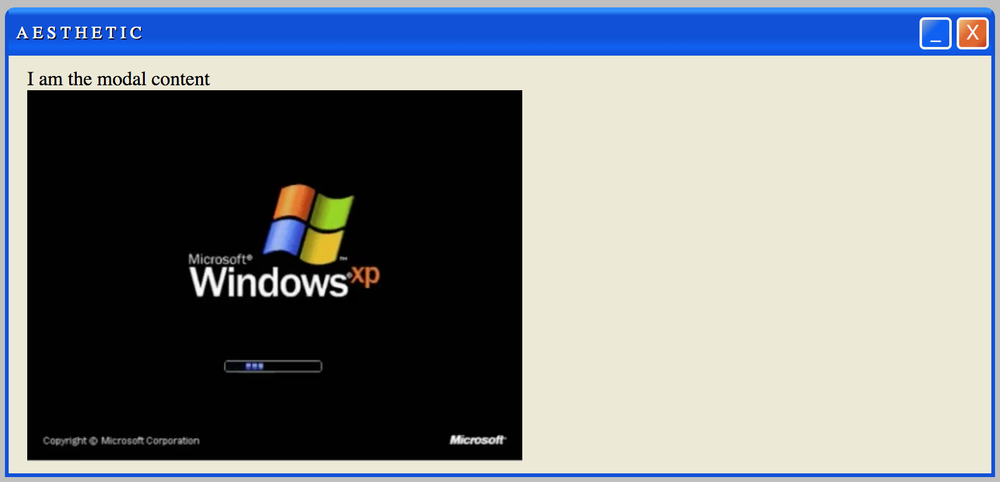

# *A E S T H E T I C   C S S*

<!--- Badges -->


[](https://www.buymeacoffee.com/torch2424)

A vaporwave css framework

[Demo / Documentation](https://torch2424.github.io/aesthetic-css/)



# Table Of Contents

* [Features](#features)
* [Example Elements](#example-elements)
* [Installation](#installation)
  * [npm](#npm)
  * [html link](#html-link)
* [Importing Modules](#importing-modules)
* [Suggested Fonts](#suggested-fonts)
  * [Google Fonts](#google-fonts)
* [Contributing](#contributing)
  * [Installation](#installation-1)
  * [Npm Scripts &amp; CLI Commands](#npm-scripts--cli-commands)
* [Reference Material](#reference-material)
* [Authors](#authors)
* [License](#license)

# Features

* Includes Elements, Colors, and Effects ✨

* Framework fits in ~40KB (as of 9/17/18) 👌

* Written with [SASS](https://sass-lang.com/), only import what you need 😍

* Compatible with [AMPHTML](https://github.com/ampproject/amphtml) ⚡

# Example Elements

     
# Installation

### npm

`npm install --save aesthetic-css`

### html link

Feel free to download the latest `aesthetic.css` from the master branch, or one of our [releases](https://github.com/torch2424/aesthetic-css/releases).

```html
<link rel="stylesheet" type="text/css" href="aesthetic.css">
```

# Importing Modules

Similar to [Bulma's Modularity](https://bulma.io/documentation/overview/modular/), you can import specific [sass](https://sass-lang.com/) files from the [src directory](./src).

For example:

`@import "../node_modules/aesthetic-css/src/variables";`

# Suggested Fonts


### Google Fonts

* [Cinzel](https://fonts.google.com/specimen/Cinzel)
* [PlayFair](https://fonts.google.com/specimen/Playfair+Display+SC)
* [Monoton](https://fonts.google.com/specimen/Monoton)
* [VT323](https://fonts.google.com/specimen/VT323)
* [Press Start 2P](https://fonts.google.com/specimen/Press+Start+2P)
* [Limelight](https://fonts.google.com/specimen/Limelight)
* [Share Tech Mono](https://fonts.google.com/specimen/Share+Tech+Mono)
* [Six Caps](https://fonts.google.com/specimen/Six+Caps)
* [Cutive Mono](https://fonts.google.com/specimen/Cutive+Mono)
* [Spectral SC](https://fonts.google.com/specimen/Spectral+SC)
* [Matte SC](https://fonts.google.com/specimen/Mate+SC)
* [Im Fell French Cannon SC]( https://fonts.google.com/specimen/IM+Fell+French+Canon+SC)

# Contributing

Feel free to fork and submit PRs! Any help is much appreciated, and would be a ton of fun! I would appreciate opening an issue, or replying to an already open issue to express intent of trying to solve the issue, and we discuss.

### Installation

Just your standard node app. Install Node with [nvm](https://github.com/creationix/nvm), `git clone` the project, and `npm install`, and you should be good to go!

### Npm Scripts & CLI Commands

```bash
# Watch for changes and serve the project. You want to use this for development/contributing.
npm run dev

# Build the demo, and the Sass to css
npm run build

# Runs npm run build, but includes the livereload script. Used in npm run dev
npm run build:dev

# Only builds the Sass to css
npm run style:build

# Run the http server for development
npm run serve

# Run the livereload server to livereload the http server
npm run livereload

# Watch the files for changes, and build
npm run watch
```

# Reference Material

* [felixrieseberg/windows95](https://github.com/felixrieseberg/windows95)
* [httpsters](http://httpsters.me)
* [r/VaporwaveAesthetics/](https://www.reddit.com/r/VaporwaveAesthetics/)
* [HTML Nostalgia: 10 Things From the 90s](https://icons8.com/articles/html-nostalgia-10-things-from-the-90s/)
* [5 ESSENTIAL VAPORWAVE FONTS](https://www.hipsthetic.com/5-essential-vaporwave-fonts/)
* [windows_98.css](https://github.com/contra/windows_98.css)
* [seapunk vaporwave colourlovers](http://www.colourlovers.com/palette/3636765/seapunk_vaporwave)
* [Text Glitch Effect](https://css-tricks.com/glitch-effect-text-images-svg/)
* [Windows 95 In your Browser](https://win95.ajf.me/)

# Authors

[Aaron Turner](https://github.com/torch2424) and [Daniel Gomez](https://github.com/echo-exe)

# License

Licensed under [Apache 2.0](https://choosealicense.com/licenses/apache-2.0/). 🐦
